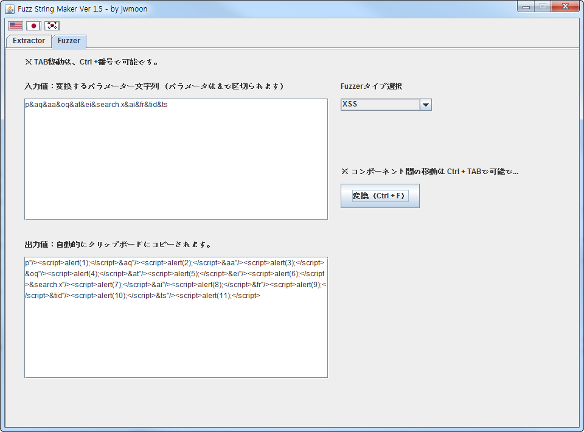

<h2>Table of Contents</h2>

<ul>
<li><a href="#sec-1">1. Extractor</a></li>
<li><a href="#sec-2">2. Fuzzer</a></li>
</ul>

# Extractor

-   htmlページでパラメータを入力することができるinputフィールドの名前を抽出します。

# Fuzzer

-   抽出されたパラメータに様々な攻撃ペイロード（fuzz文字列）を設定することができます。

